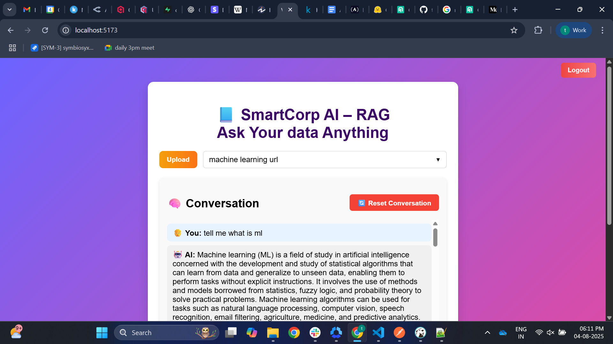
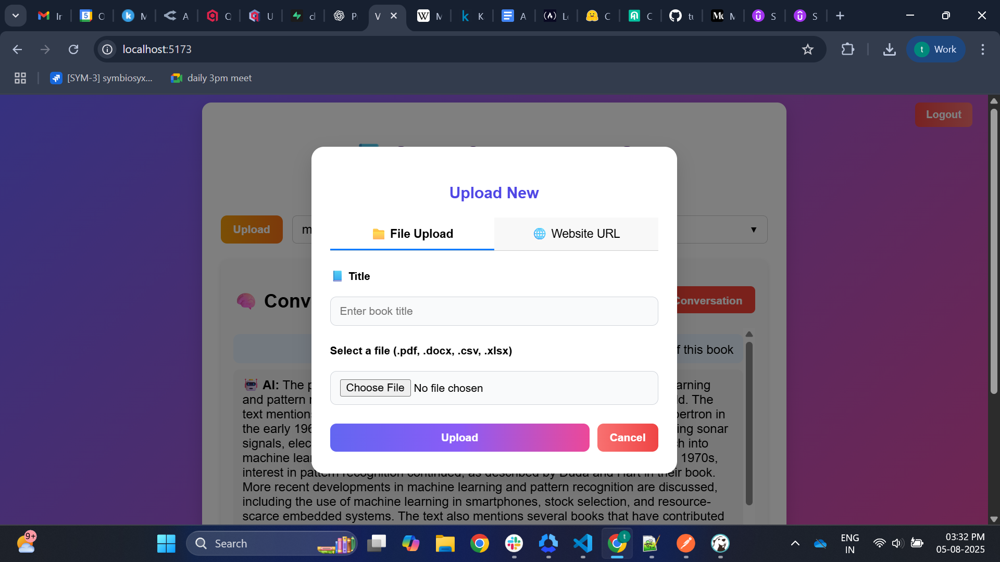

# 📘 EduQuest: AI-Powered Document Q&A Platform

EduQuest is an AI-powered **hybrid RAG (Retrieval-Augmented Generation)** system that allows users to upload files (PDFs, DOCX, Excel, CSV) or website URLs, and then ask questions about the uploaded content — in both conversational and analytical formats.

## 🚀 Features

- ✅ **Universal Upload**: Upload PDFs, Word docs, Excel/CSV files, or scrape content from a website URL.
- 🤖 **Smart Question Answering**: Ask natural language questions — get intelligent answers with contextual understanding.
- 💬 **Conversational Memory**: Maintains ongoing context for follow-up questions just like ChatGPT.
- 📚 **Citations**: Each AI response includes source references (chunk-level), showing where the answer came from (e.g., `PDF: Novel Book, Chunk 3`).
- 🧠 **Intent Detection**: Uses LLM to classify questions as: summary, translation, MCQs, numerical analysis, metadata, etc.
- 📊 **Structured Data Analysis**: Supports Excel/CSV tables (like hospital bills, financial data) and dynamically generates SQL queries using LLM.
- 🧼 **Chat History Reset**: Per-book conversational memory can be cleared by the user.
- 🌐 **Secure Auth**: Uses JWT-based login and authentication.

## 🛠️ Tech Stack

### 🧩 Backend (Django)
- Django REST Framework
- PostgreSQL for structured data
- Qdrant for vector-based semantic search
- HuggingFace & OpenRouter (Mistral 7B) for LLM inference
- Custom extractors for:
  - PDF (`pdfminer`)
  - DOCX (`python-docx`)
  - Website content (`newspaper3k` / `BeautifulSoup`)
  - Excel/CSV (`pandas`)

### 💻 Frontend (React)
- React with functional components + hooks
- Axios for API communication
- Custom CSS for UI (chat bubbles, modal upload, dropdowns, etc.)
- Conversational layout (user messages right-aligned, AI left-aligned)

## 📂 How It Works

1. **Upload a source**:
   - PDF/DOCX → parsed and chunked into vector DB
   - Excel/CSV → loaded into PostgreSQL in long-format
   - Website URL → scraped and embedded like PDFs

2. **Ask a question**:
   - System detects intent
   - Uses vector or SQL search depending on source type
   - RAG pipeline runs LLM generation with selected context
   - AI returns answer + source citations

3. **Converse naturally**:
   - Memory retained across turns for follow-up questions

## 📸 UI Highlights

- 📁 Upload modal with tabs (File / Website)
- 🧠 Chat interface with alternating AI/User bubbles
- 🔄 Reset conversation button
- 📚 Citation display under each AI response

## ⚙️ Setup Instructions

> (Customize these commands to match your local project layout)

```bash
# Backend
cd backend
pip install -r requirements.txt
python manage.py migrate
python manage.py runserver

# Frontend
cd frontend
npm install
npm run dev
```

---

> Built with ❤️ for smart learning & AI-powered education.



